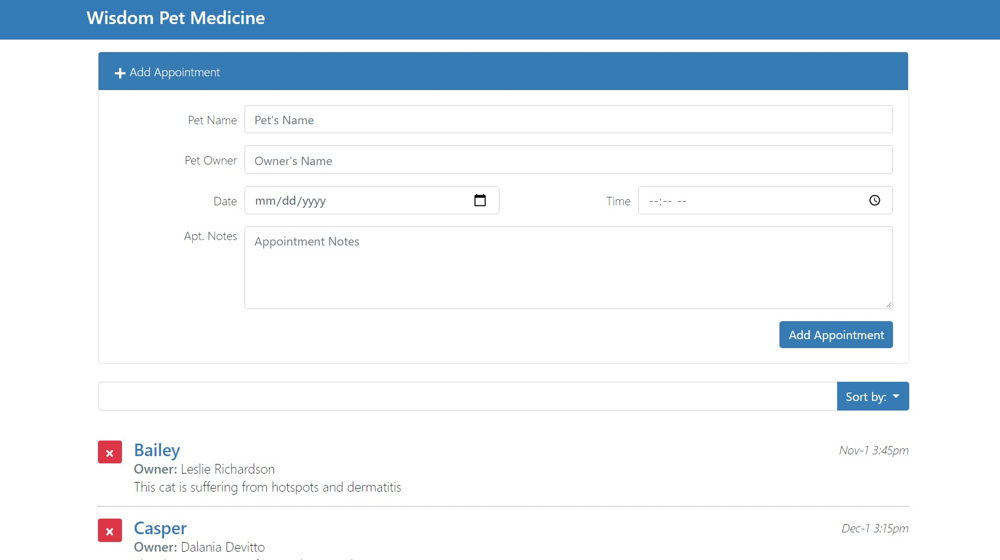

## Building Interface | React

### Learning Objectives

Building a basic app with create-react-app
Adding modules
Creating sub components
Working with states and expressions
Passing data through props
Using third-party components
Handling events through props
Adding and editing records
Searching and sorting

- Moments
- React Icons
- Lodash { without, findIndex }
- State
- Props
- React Bootstrap
